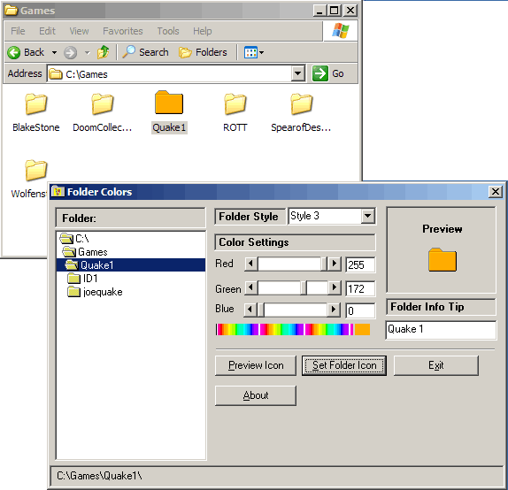



## Color Folders

### Description

Color folder is a small tool to chnage the color of a folder, I made this example after seeing GioRock Custom Cursors Color example. that gave me an idea, anyway you chnage the folder color, and it also does a small amount of shadeing, there are also some folder styles. and the option to set the icon on a folder. anyway hope you like it, agian Thanks to GioRock for shareing his example.
 
### More Info
 

             |
---                |---
**Submitted On**   |2007-05-30 21:24:42
**By**             |[dreamvb](https://github.com/Planet-Source-Code/PSCIndex/blob/master/ByAuthor/dreamvb.md)
**Level**          |Intermediate
**User Rating**    |4.8 (19 globes from 4 users)
**Compatibility**  |VB 5\.0, VB 6\.0
**Category**       |[Files/ File Controls/ Input/ Output](https://github.com/Planet-Source-Code/PSCIndex/blob/master/ByCategory/files-file-controls-input-output__1-3.md)
**World**          |[Visual Basic](https://github.com/Planet-Source-Code/PSCIndex/blob/master/ByWorld/visual-basic.md)
**Archive File**   |[Color\_Fold2068275302007\.zip](https://github.com/Planet-Source-Code/dreamvb-color-folders__1-68713/archive/master.zip)

